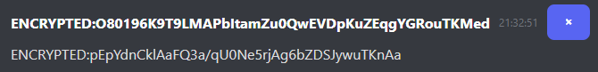

# Copyright © 2025 AIGsniper

All Rights Reserved.

This repository is publicly viewable, but **no part of this code**—including JavaScript, CSS, HTML, or assets—may be copied, modified, redistributed, or used in any other projects **without explicit permission** from the author.

For inquiries or requests for reuse, please contact the author directly.

with the serious stuff done, heres what the encryption looks like for network traffic :D :

The server requires someone to activate it using a password (preferably me)
The Moderator has a few commands for use:

/kickall

/clear

/s [server_message]
